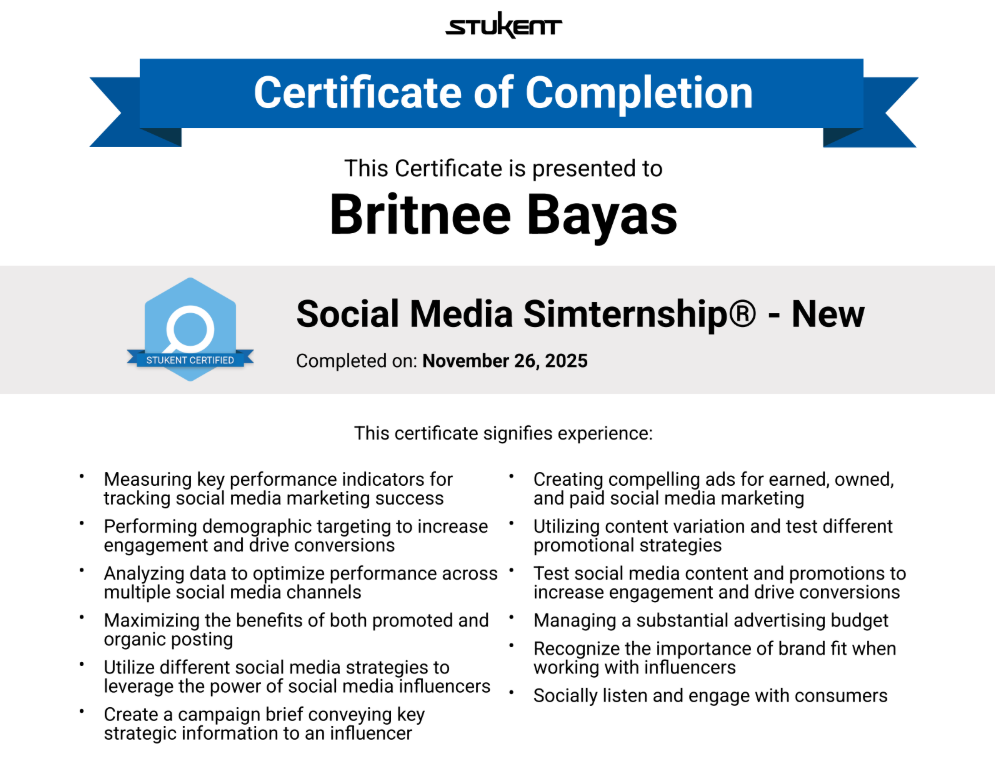

# 📱 Social Media Marketing Simternship
> *Social Media Strategy | Analytics | Content Management | Performance Tracking*

Completed the Stukent Social Media Simternship, a hands-on simulation managing real social media marketing decisions across platforms. Took over the @socialmediamarketing_hofstra Instagram and Facebook accounts, conducting a pre-takeover audit analyzing brand voice, tone, and baseline metrics. Tracked performance throughout the takeover week and delivered a comprehensive report with reflections and strategic recommendations. Helped drive **927,852 impressions** and **$63,970 in revenue** through strategic campaign execution.

---

## 📌 Key Highlights
- Conducted a full pre-takeover social media audit covering brand voice, tone, and baseline engagement metrics
- Managed content across Instagram and Facebook for @socialmediamarketing_hofstra
- Tracked KPIs throughout the campaign including impressions, engagement rate, and conversions
- Generated 927,852 impressions and $63,970 in revenue through strategic campaign decisions
- Delivered a post-takeover report with data-driven reflections and recommendations
- Completed November 26, 2025 — Stukent Certified

---

## 🛠️ Skills Demonstrated
- Measuring KPIs for tracking social media marketing success
- Performing demographic targeting to increase engagement and drive conversions
- Analyzing data to optimize performance across multiple social media channels
- Maximizing the benefits of both promoted and organic posting
- Utilizing social media influencer strategies
- Creating compelling ads for earned, owned, and paid social media marketing
- Utilizing content variation and testing different promotional strategies
- Managing a substantial advertising budget
- Recognizing brand fit when working with influencers
- Social listening and consumer engagement

---

## 🏅 Certificate of Completion

